# Sistema de riego automatizado
El proyecto consiste en mantener una planta con cierto rango de humedad. Para ello debemos estar leyendo constantemente la humedad de la planta, y en tal caso de que tenga poca humedad, encender el sistema de riego.

## Materiales
| Cantidad | Artículo                  |                                        Imagen                                        |
|:--------:|:--------------------------|:------------------------------------------------------------------------------------:|
|   0.5    | Cable de red UTP (Metros) |            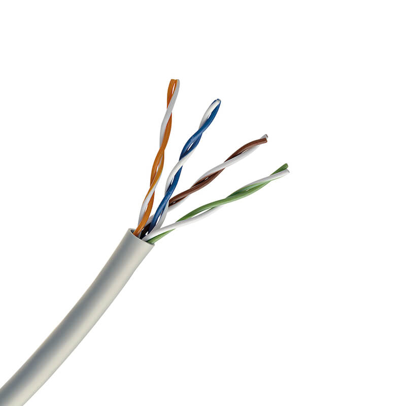             |
|    1     | Arduino UNO               | 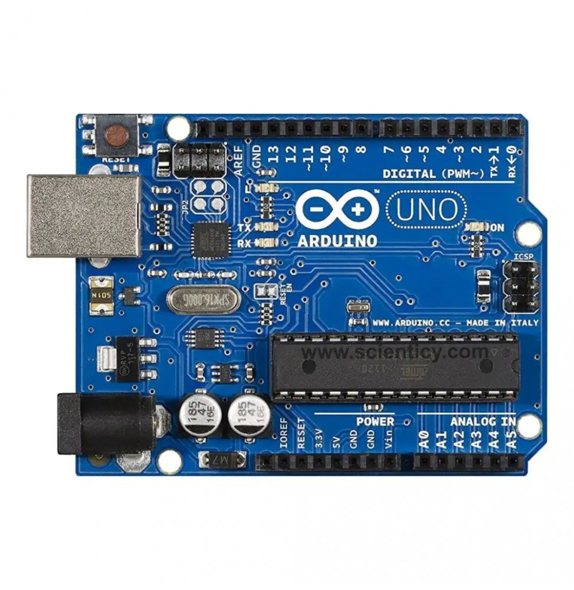 |
|    1     | Sensor de humedad LM393   |         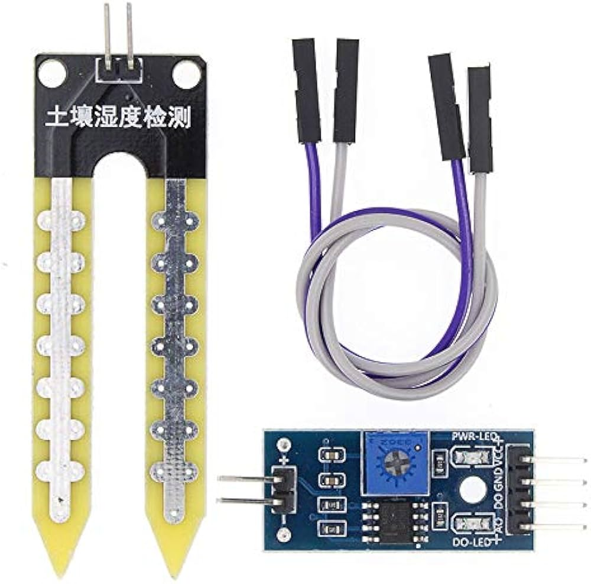          |
|    1     | Bomba de agua para pecera |        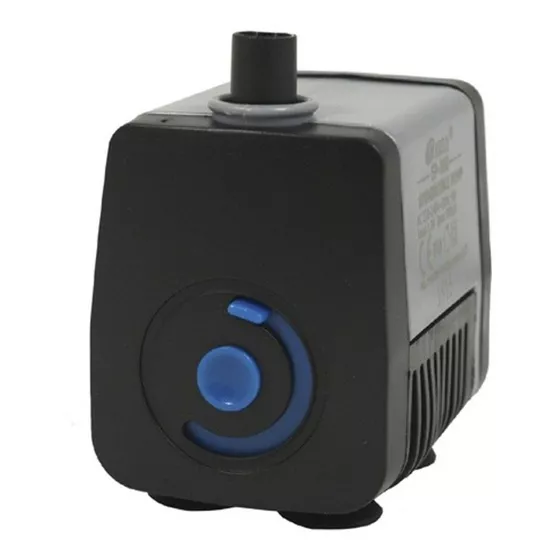        |
|    1     | Led (Cualquier color)     |                   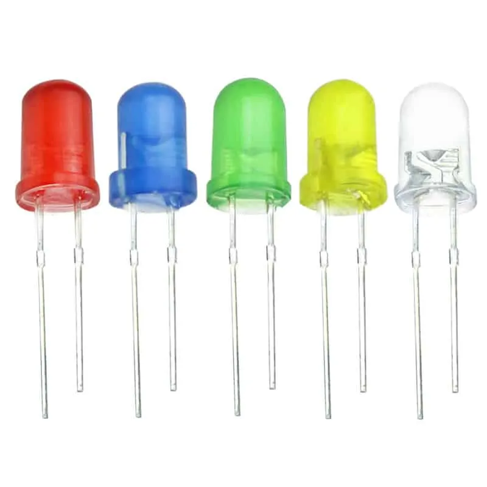                   |
|    1     | Resistencia 240 Ω         |               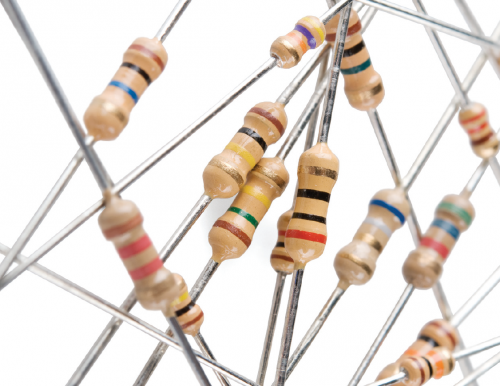               |
|    1     | Resistencia 1 kΩ          |                              |
|    1     | Resistencia 10 kΩ         |                              |
|    1     | Micro Pulsador            |             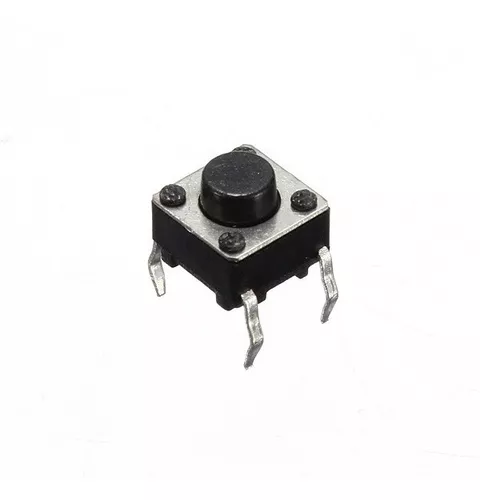              |
|    1     | Transistor 2N2222A (BJT)  |          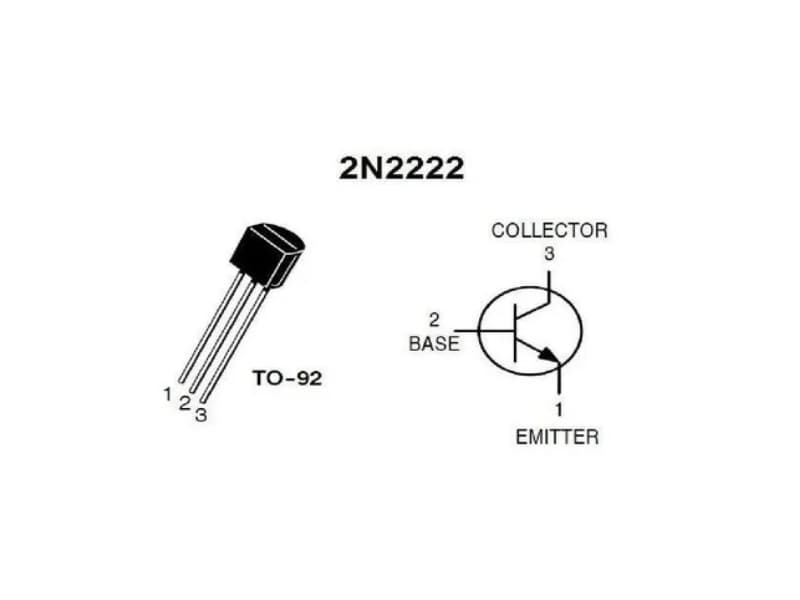          |
|    1     | Relé de 5 VDC             |              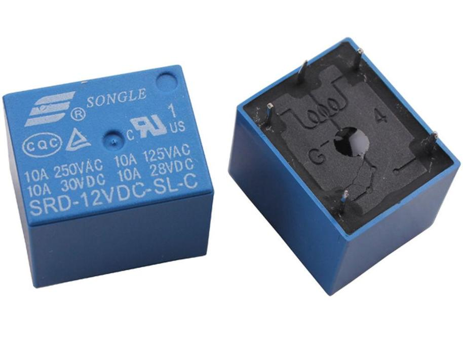               |
|    1     | Diodo                     |                  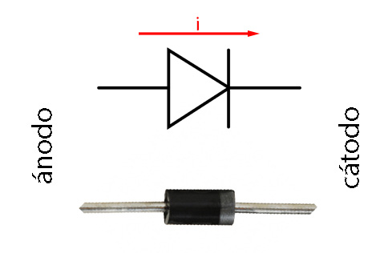                   |

## Programación
- [Arduino UNO](./arduino-sistema-de-riego.ino)

## Recursos utilizados

### Uso y configuración del sensor de humedad LM393 (Video)

### Uso y configuración del relé de 5 VDC (Video)

### Esquema del Arduino UNO
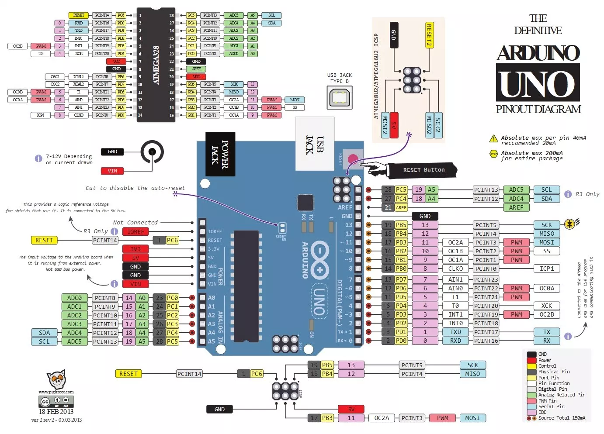